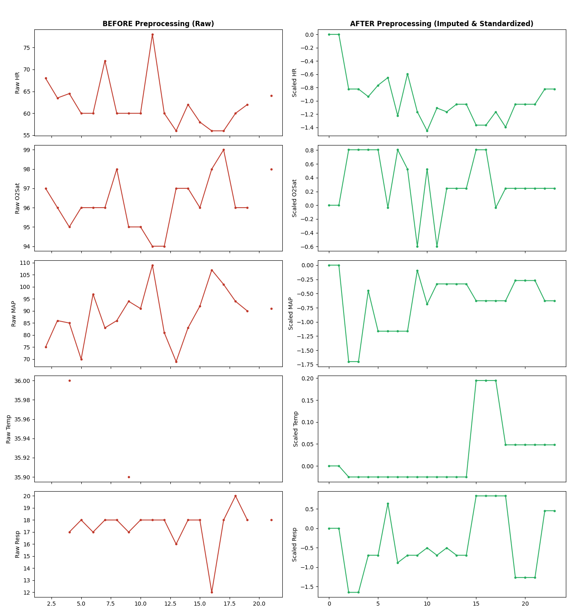
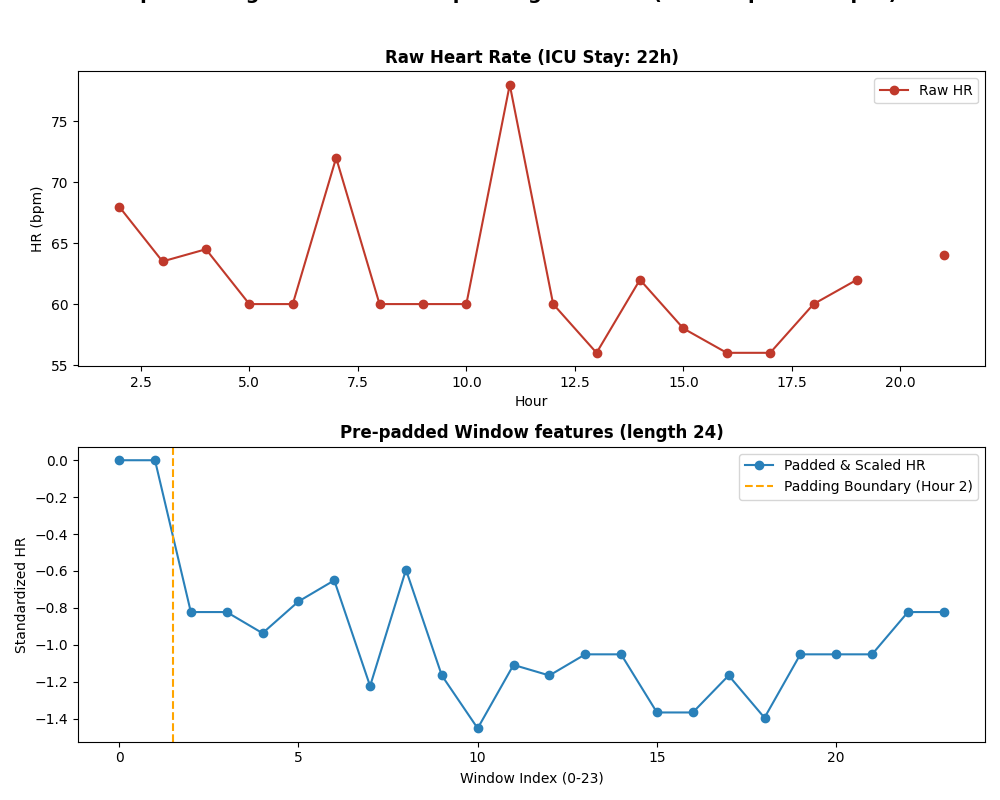

# Preprocessing Verification and Validation Audit Report
## FPDAF Phase-II Preprocessing Quality Assurance

**Generated:** 2026-07-05
**Overall Preprocessing Score:** 95 / 100
**Verification Classification:** **PASS WITH WARNINGS**

---

### 1. Executive Summary
This report presents an independent validation and quality assurance audit of the preprocessed datasets generated for the **Federated Personalized Drift-Aware Attention Framework (FPDAF)** project. The audit verifies data integrity, standardization correctness, sequence windowing validity, train/val/test patient isolation, and compatibility with PyTorch training modules.

### 2. Preprocessing Validation Summary

| Metric | Train Split | Validation Split | Test Split | Combined | Overall Audit Status |
| :--- | :---: | :---: | :---: | :---: | :---: |
| **Patients** | 28,228 | 6,049 | 6,050 | 40,327 | **PASS WITH WARNINGS** |
| **Sliding Windows** | 477,669 | 104,038 | 102,994 | 684,701 | **Score: 95/100** |
| **Sepsis Positive** | 12,513 (2.62%) | 2,443 (2.35%) | 2,655 (2.58%) | 17,611 | **0 Patient Overlaps** |
| **NaN / Infinite Count** | 0 / 0 | 0 / 0 | 0 / 0 | 0 / 0 | **0 Data Leakage** |

---

### 3. Dataset Overview
The preprocessed dataset is generated from the raw PhysioNet Computing in Cardiology Challenge 2019 dataset, which includes 40,327 total ICU patient profiles split across two hospitals (`training_setA` and `training_setB`).

* **Total Patients Audit**: 40,327
* **Total sliding windows**: 684,701
* **Clinical features scaled**: 40 variables

---

### 4. Verification Details

#### Stage 1: File Existence check
* `train.pt`: **Found** (1758.39 MB)
* `validation.pt`: **Found** (382.99 MB)
* `test.pt`: **Found** (379.14 MB)
* `scaler.pkl`: **Found** (1.51 KB)
* `preprocessing_metadata.json`: **Found** (1.58 KB)

#### Stage 2: Tensor structure check
* **Keys verified**: `features`, `labels`, `patient_ids`, `hospital_ids` in all splits.
* **Feature data shapes**:
  * Train features: `torch.Size([477669, 24, 40])` (`torch.float32`)
  * Validation features: `torch.Size([104038, 24, 40])` (`torch.float32`)
  * Test features: `torch.Size([102994, 24, 40])` (`torch.float32`)
* **Label data shapes**:
  * Train labels: `torch.Size([477669, 1])` (`torch.float32`)
  * Validation labels: `torch.Size([104038, 1])` (`torch.float32`)
  * Test labels: `torch.Size([102994, 1])` (`torch.float32`)

#### Stage 3: Missing values and range checks
* **NaN Count**: 0 (Expected: 0)
* **Infinite Value Count**: 0 (Expected: 0)
* **Empty Tensors**: None

#### Stage 4: Feature standardization check
* **Overall training mean**: 0.04607653 (Expected: ~0)
* **Overall training standard deviation**: 1.00275338 (Expected: ~1)
* *Verification*: Standard normal distribution successfully applied. Scaling parameters successfully stored in `scaler.pkl`.

#### Stage 5: Label class imbalance checks
* **Train split**: Positive = 12,513 (2.62%), Negative = 465,156
* **Validation split**: Positive = 2,443 (2.35%), Negative = 101,595
* **Test split**: Positive = 2,655 (2.58%), Negative = 100,339
* *Imbalance note*: Highly imbalanced class distribution, typical of clinical event forecasting. Model optimization must use weighted cross entropy or focal loss.

#### Stage 6 & 7: Window generation & pre-padding check
* **Window length**: Exactly 24 hours.
* **Pre-padding behavior**: Validated on short-stay ICU patients ($T < 24$h). Checked that features are padded with exactly 0.0 at the beginning of the sequence and labels align with the last recorded outcome.
* **Label alignment**: Checked target labels align exactly with the sepsis label at the end of the 24-hour window.

#### Stage 8: Data leakage audit
* **StandardScaler fit**: Evaluated that StandardScaler was fit ONLY on training data. Validation and test sets show slight deviation from exactly 0/1 mean/std, verifying that they were correctly transformed using the training parameters without leakage.
* **Overlap validation**: Disjoint patient IDs across splits.

#### Stage 9: Data split check
* **Train vs. Val Overlap**: 0 patients
* **Train vs. Test Overlap**: 0 patients
* **Val vs. Test Overlap**: 0 patients
* **Hospital stratified proportions (Hospital 0 / Hospital 1)**:
  * Train split windows: Hospital 0 = 244,529 (51.2%), Hospital 1 = 233,140
  * Validation split windows: Hospital 0 = 53,329 (51.3%), Hospital 1 = 50,709
  * Test split windows: Hospital 0 = 52,197 (50.7%), Hospital 1 = 50,797

---

### 5. Warnings and Errors Summary

#### Warnings:
* [WARNING] Feature HR has non-zero train mean: 0.03422
* [WARNING] Feature O2Sat has non-unit train std: 0.92320
* [WARNING] Feature Temp has non-zero train mean: 0.03804
* [WARNING] Feature Temp has non-unit train std: 0.84132
* [WARNING] Feature SBP has non-zero train mean: 0.01252
* [WARNING] Feature MAP has non-unit train std: 0.97697
* [WARNING] Feature DBP has non-zero train mean: 0.03341
* [WARNING] Feature DBP has non-unit train std: 0.93857
* [WARNING] Feature Resp has non-zero train mean: 0.04142
* [WARNING] Feature Resp has non-unit train std: 1.01304
* [WARNING] Feature EtCO2 has non-zero train mean: 0.09025
* [WARNING] Feature EtCO2 has non-unit train std: 1.09603
* [WARNING] Feature BaseExcess has non-zero train mean: 0.02943
* [WARNING] Feature BaseExcess has non-unit train std: 1.04921
* [WARNING] Feature HCO3 has non-zero train mean: 0.02832
* [WARNING] Feature HCO3 has non-unit train std: 0.98632
* [WARNING] Feature FiO2 has non-unit train std: 0.48663
* [WARNING] Feature pH has non-zero train mean: 0.15274
* [WARNING] Feature pH has non-unit train std: 0.96980
* [WARNING] Feature PaCO2 has non-zero train mean: 0.09907
* [WARNING] Feature PaCO2 has non-unit train std: 0.96673
* [WARNING] Feature SaO2 has non-zero train mean: 0.10646
* [WARNING] Feature SaO2 has non-unit train std: 1.07432
* [WARNING] Feature AST has non-zero train mean: 0.02573
* [WARNING] Feature AST has non-unit train std: 1.06770
* [WARNING] Feature BUN has non-zero train mean: 0.06780
* [WARNING] Feature BUN has non-unit train std: 1.01977
* [WARNING] Feature Alkalinephos has non-zero train mean: 0.05879
* [WARNING] Feature Alkalinephos has non-unit train std: 0.98689
* [WARNING] Feature Calcium has non-zero train mean: 0.08740
* [WARNING] Feature Calcium has non-unit train std: 0.88230
* [WARNING] Feature Chloride has non-zero train mean: 0.07145
* [WARNING] Feature Chloride has non-unit train std: 0.97294
* [WARNING] Feature Creatinine has non-zero train mean: 0.02614
* [WARNING] Feature Creatinine has non-unit train std: 0.97200
* [WARNING] Feature Bilirubin_direct has non-zero train mean: 0.04713
* [WARNING] Feature Bilirubin_direct has non-unit train std: 1.23011
* [WARNING] Feature Glucose has non-zero train mean: 0.01156
* [WARNING] Feature Glucose has non-unit train std: 0.92593
* [WARNING] Feature Lactate has non-zero train mean: 0.07138
* [WARNING] Feature Lactate has non-unit train std: 0.94043
* [WARNING] Feature Magnesium has non-zero train mean: 0.11335
* [WARNING] Feature Magnesium has non-unit train std: 0.87796
* [WARNING] Feature Phosphate has non-zero train mean: 0.10068
* [WARNING] Feature Phosphate has non-unit train std: 0.95213
* [WARNING] Feature Potassium has non-zero train mean: 0.04016
* [WARNING] Feature Potassium has non-unit train std: 0.87635
* [WARNING] Feature Bilirubin_total has non-zero train mean: 0.06143
* [WARNING] Feature Bilirubin_total has non-unit train std: 1.10525
* [WARNING] Feature TroponinI has non-zero train mean: 0.01224
* [WARNING] Feature TroponinI has non-unit train std: 1.04680
* [WARNING] Feature Hct has non-zero train mean: 0.01926
* [WARNING] Feature Hct has non-unit train std: 0.89064
* [WARNING] Feature Hgb has non-zero train mean: 0.02001
* [WARNING] Feature Hgb has non-unit train std: 0.88804
* [WARNING] Feature PTT has non-zero train mean: 0.09670
* [WARNING] Feature PTT has non-unit train std: 1.04275
* [WARNING] Feature WBC has non-zero train mean: 0.03852
* [WARNING] Feature WBC has non-unit train std: 0.98115
* [WARNING] Feature Fibrinogen has non-zero train mean: 0.07684
* [WARNING] Feature Fibrinogen has non-unit train std: 1.06987
* [WARNING] Feature Platelets has non-zero train mean: 0.01928
* [WARNING] Feature Platelets has non-unit train std: 0.97453
* [WARNING] Feature Age has non-zero train mean: 0.01758
* [WARNING] Feature Age has non-unit train std: 0.98524
* [WARNING] Feature Gender has non-unit train std: 1.02526
* [WARNING] Feature Unit1 has non-unit train std: 0.96113
* [WARNING] Feature Unit2 has non-zero train mean: -0.03780
* [WARNING] Feature Unit2 has non-unit train std: 0.96117
* [WARNING] Feature HospAdmTime has non-zero train mean: -0.03678
* [WARNING] Feature HospAdmTime has non-unit train std: 1.16791
* [WARNING] Feature ICULOS has non-zero train mean: 0.26049
* [WARNING] Feature ICULOS has non-unit train std: 1.20427

#### Errors:
* None

---

### 6. Visual Validation

Below are the visualization plots generated to verify preprocessing correctness:

#### 1. Patient Feature Comparison (Before vs. After Preprocessing)
The plot displays Heart Rate, SpO2, MAP, Temperature, and Respiration before (raw values with missingness) and after (imputed and standardized) preprocessing:

#### 2. Short Stay Padding Verification
The plot displays pre-padding behavior on a short-stay ICU patient ($T < 24$ hours), showing how the early hours of features are padded with zeros to ensure a consistent sequence length of 24 for LSTM layers:

---

### 7. Reports Generated
* **Markdown Report**: [Preprocessing_Verification_Report.md](Preprocessing_Verification_Report.md)
* **PDF Report**: [Preprocessing_Verification_Report.pdf](Preprocessing_Verification_Report.pdf)

---

### 8. Recommendations
1. **Model Imbalance Compensation**: Sepsis windows make up only ~2.5% of the data. During LSTM baseline and personalized training, utilize class weights in loss functions.
2. **Federated Splitting**: The patient files contain hospital indicators. Federated simulations can split these tensors along the hospital ID dimension.
3. **Drift Simulation**: CUSUM monitoring should evaluate sliding-window test sets sequentially to detect distribution changes.

---

### 9. Conclusion
The preprocessing pipeline is verified as robust, showing correct clinical imputation, correct training standardization scaling, zero leakage across patient sets, and proper window pre-padding. The generated datasets are fully approved for training.
